# Formatters Subsystem - Contributor Documentation

This document provides an in-depth overview of the Reqnroll Formatters subsystem, which is responsible for generating Cucumber Messages output (NDJSON files and HTML reports) during test execution.

## Table of Contents

1. [Overview](#overview)
2. [Structural Overview](#structural-overview)
3. [Startup Process](#startup-process)
4. [Execution Events](#execution-events)
5. [Formatter Class Hierarchy](#formatter-class-hierarchy)
6. [Configuration](#configuration)

---

## Overview

The Formatters subsystem implements the [Cucumber Messages Protocol](https://github.com/cucumber/messages), providing a standardized way to output test execution data. This enables integration with various reporting tools that understand the Cucumber Messages format.

Key capabilities:
- **NDJSON Output**: Raw Cucumber Messages in newline-delimited JSON format
- **HTML Reports**: Interactive HTML reports using the Cucumber HTML formatter
- **Extensibility**: Base classes for creating custom formatters

---

## Structural Overview

The Formatters subsystem is organized into several key namespaces:

```
Reqnroll/Formatters/
+-- Configuration/           # Configuration resolution
+-- ExecutionTracking/       # Test execution state tracking
+-- Html/                    # HTML formatter implementation
+-- Message/                 # NDJSON message formatter
+-- PayloadProcessing/       # Cucumber message creation
|   +-- Cucumber/            # Message factory and utilities
+-- PubSub/                  # Publisher/Subscriber infrastructure
+-- RuntimeSupport/          # Runtime support utilities
```

### Core Class Structure

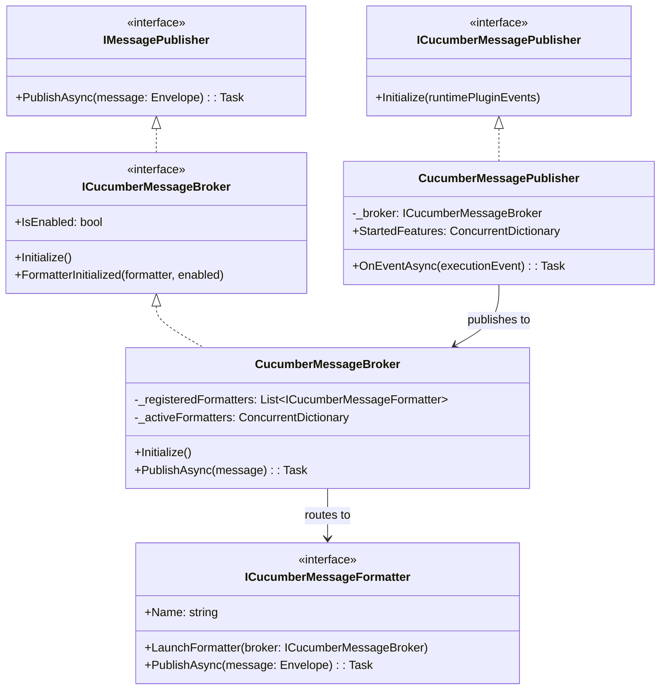

### PubSub Architecture

The Formatters use a publish/subscribe pattern:

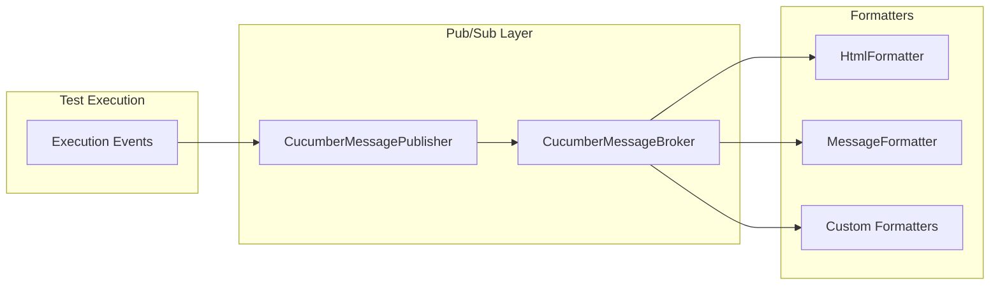

---

## Startup Process

The Formatters subsystem is initialized during `ContainerBuilder.CreateGlobalContainer()`. Here's the detailed startup sequence:

### Initialization Sequence Diagram

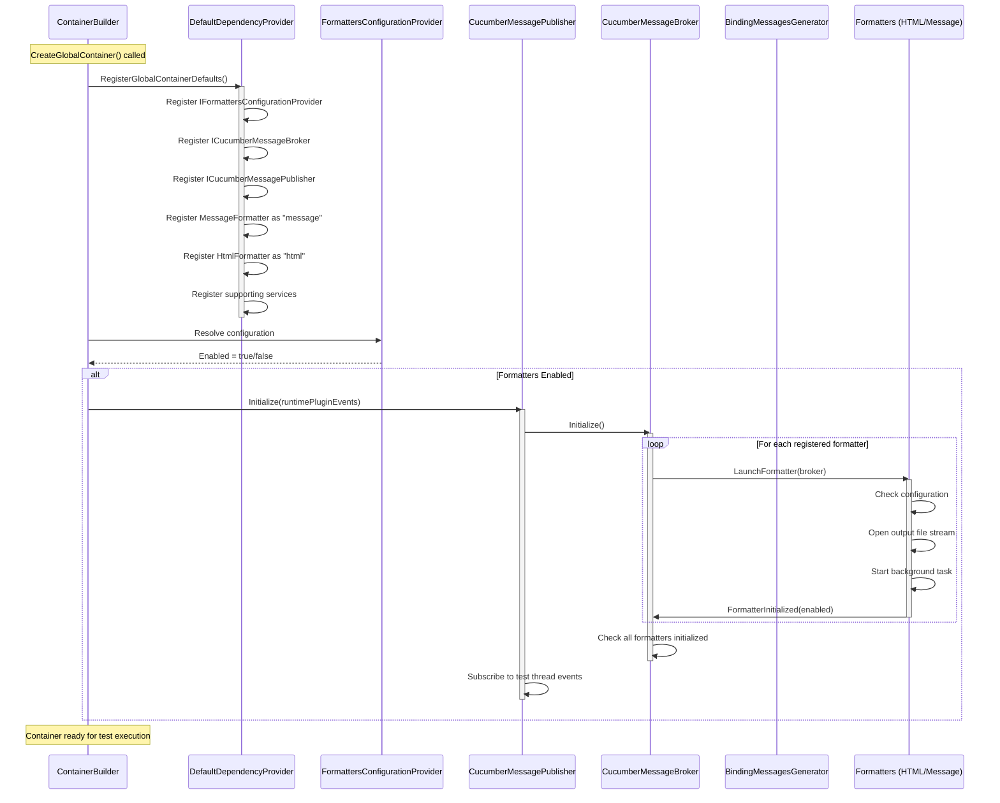

### Startup Code Flow

1. **Dependency Registration** (`DefaultDependencyProvider.RegisterGlobalContainerDefaults`):
   ```csharp
   // Formatter configuration
   container.RegisterTypeAs<FormattersConfigurationProvider, IFormattersConfigurationProvider>();
   
   // Formatters (named registrations)
   container.RegisterTypeAs<MessageFormatter, ICucumberMessageFormatter>("message");
   container.RegisterTypeAs<HtmlFormatter, ICucumberMessageFormatter>("html");
   
   // Pub/Sub infrastructure
   container.RegisterTypeAs<CucumberMessageBroker, ICucumberMessageBroker>();
   container.RegisterTypeAs<CucumberMessagePublisher, ICucumberMessagePublisher>();
   ```

2. **Publisher Initialization** (`ContainerBuilder.CreateGlobalContainer`):
   ```csharp
   var cucumberMessageConfiguration = container.Resolve<IFormattersConfigurationProvider>();
   if (cucumberMessageConfiguration.Enabled)
       container.Resolve<ICucumberMessagePublisher>().Initialize(runtimePluginEvents);
   ```

3. **Broker Initialization** (`CucumberMessageBroker.Initialize`):
   - Iterates through all registered formatters
   - Calls `LaunchFormatter()` on each
   - Formatters report back via `FormatterInitialized()`

4. **Formatter Launch** (`FormatterBase.LaunchInner`):
   - Validates configuration
   - Opens output file stream (for file-based formatters)
   - Starts background message consumption task

---

## Execution Events

The Formatters respond to execution events published by the test execution engine. Each event triggers message generation and publishing.

### Event Tracking Architecture

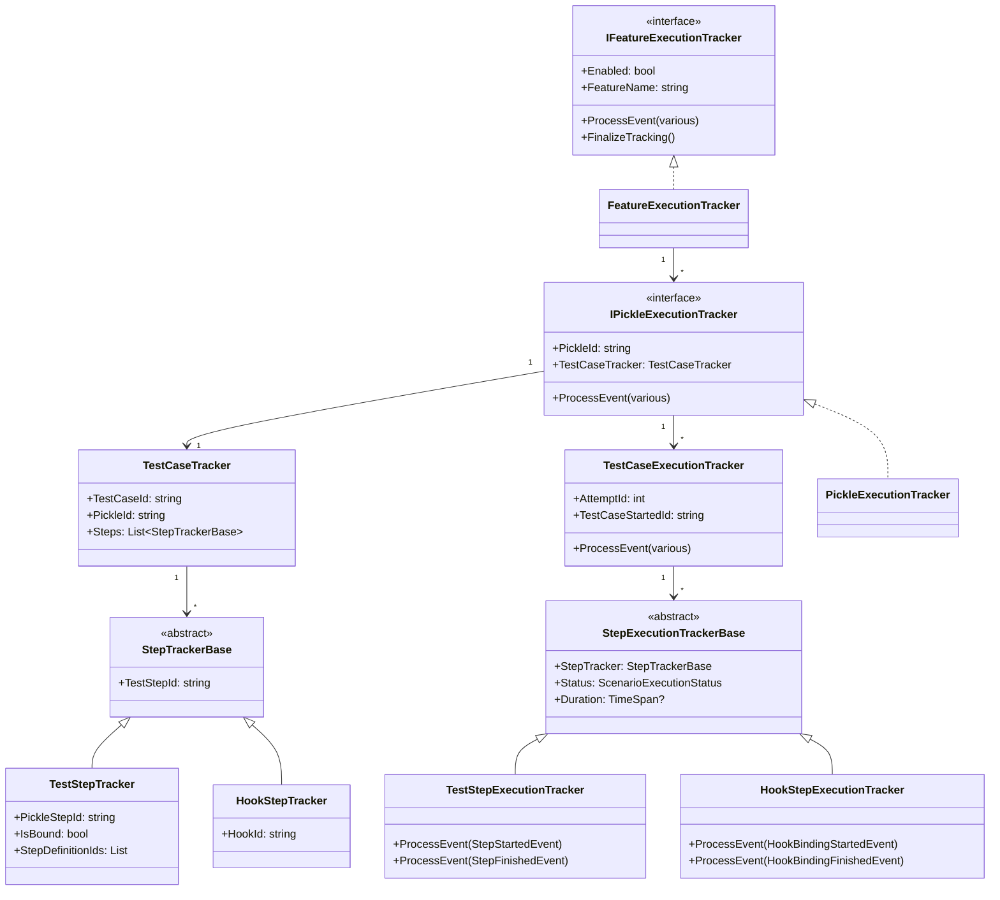

### TestRunStarted Event

Triggered when the test run begins.

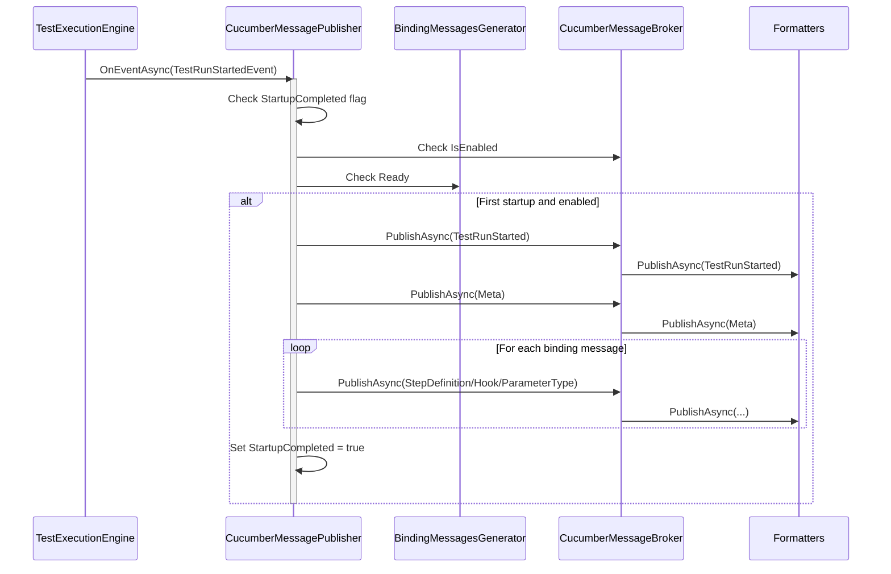

**Messages Published:**
- `TestRunStarted` - Marks the beginning of the test run
- `Meta` - Contains environment metadata
- `ParameterType` - For each step argument transformation
- `StepDefinition` - For each step definition binding
- `Hook` - For each hook binding

### FeatureStarted Event

Triggered when a feature begins execution.

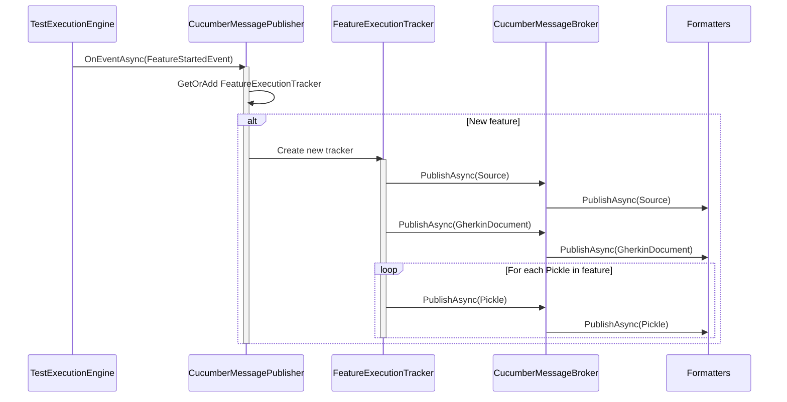

**Messages Published:**
- `Source` - The feature file content
- `GherkinDocument` - Parsed feature AST
- `Pickle` - One for each scenario/example combination

### ScenarioStarted Event

Triggered when a scenario begins execution.

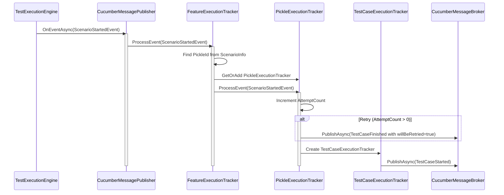

**Messages Published:**
- `TestCaseStarted` - Marks scenario execution start
- (On retry) `TestCaseFinished` with `willBeRetried=true`

### StepStarted Event

Triggered when a step begins execution.

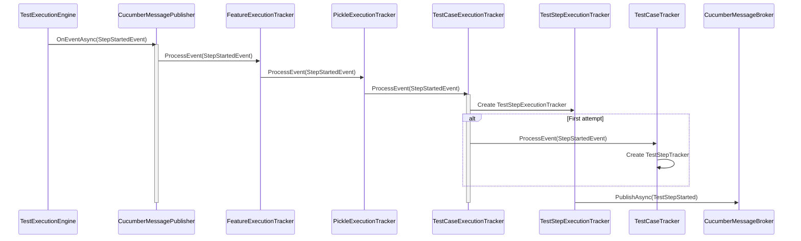

**Messages Published:**
- `TestStepStarted` - Marks step execution start

### HookStarted Event

Triggered when a hook begins execution.

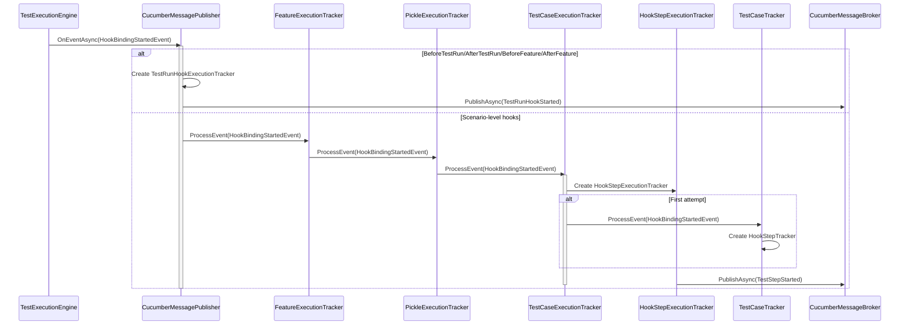

**Messages Published:**
- `TestStepStarted` - For hook execution (hooks are modeled as test steps)

---

## Formatter Class Hierarchy

The Formatters follow a well-defined class hierarchy that provides increasing levels of functionality:

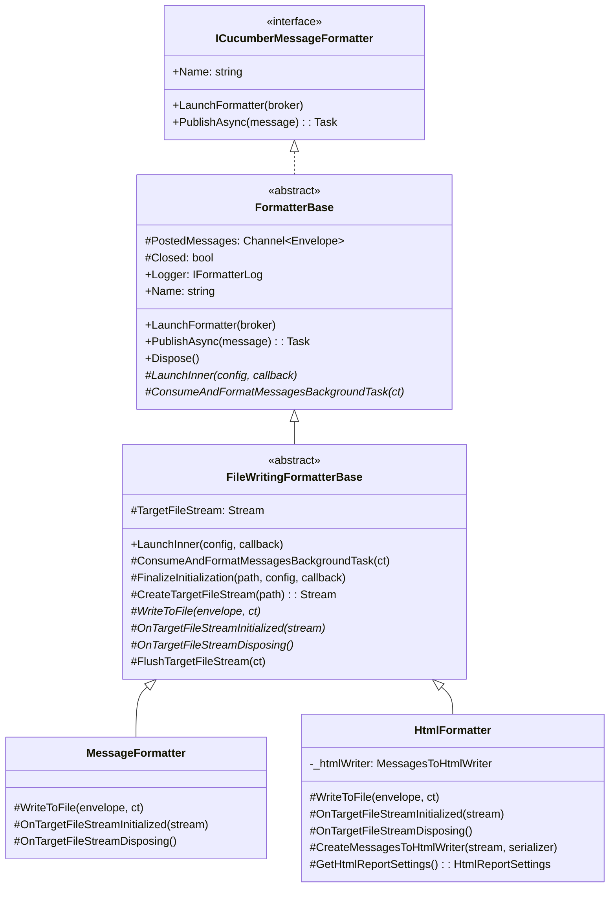

### FormatterBase

The abstract base class for all formatters. Provides:

- **Message Channel**: Unbounded channel for receiving messages asynchronously
- **Lifecycle Management**: Launch, close, and dispose patterns
- **Configuration Integration**: Access to formatter configuration
- **Background Processing**: Abstract method for message consumption

Key methods:
| Method | Purpose |
|--------|---------|
| `LaunchFormatter()` | Entry point called by broker during initialization |
| `LaunchInner()` | Abstract - formatter-specific initialization |
| `PublishAsync()` | Receives messages from broker, adds to channel |
| `ConsumeAndFormatMessagesBackgroundTask()` | Abstract - processes messages from channel |
| `CloseAsync()` | Signals channel completion, waits for processing |
| `Dispose()` | Cleanup with timeout handling |

### FileWritingFormatterBase

Extends `FormatterBase` for formatters that write to files. Provides:

- **File Path Resolution**: Handles configured paths with variable substitution
- **Stream Management**: Opens, flushes, and closes file streams
- **Error Handling**: Graceful handling of file system errors

Key methods:
| Method | Purpose |
|--------|---------|
| `LaunchInner()` | Resolves output path, creates directory, opens stream |
| `FinalizeInitialization()` | Creates file stream, calls initialization hook |
| `WriteToFile()` | Abstract - write single message to file |
| `OnTargetFileStreamInitialized()` | Abstract - hook for stream setup |
| `OnTargetFileStreamDisposing()` | Abstract - hook for stream cleanup |
| `FlushTargetFileStream()` | Ensures all data written to disk |

### MessageFormatter

Produces Cucumber Messages NDJSON output files (`.ndjson`).

- **Output**: One JSON object per line (newline-delimited)
- **Default File**: `reqnroll_report.ndjson`
- **Serialization**: Uses `NdjsonSerializer`

### HtmlFormatter

Produces interactive HTML reports using the Cucumber HTML formatter library.

- **Output**: Self-contained HTML file with embedded viewer
- **Default File**: `reqnroll_report.html`
- **Dependencies**: `Cucumber.HtmlFormatter` library

---

## Configuration

Formatters are configured through the `reqnroll.json` file or environment variables.

### Configuration Resolution Chain

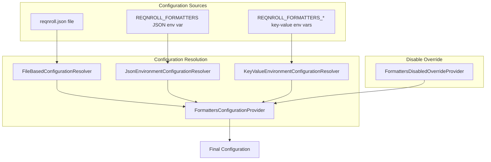

> **Note:** Configuration sources are evaluated in order: file-based first, then JSON environment variable, then key-value environment variables. Later sources can override earlier ones.

### Configuration Classes

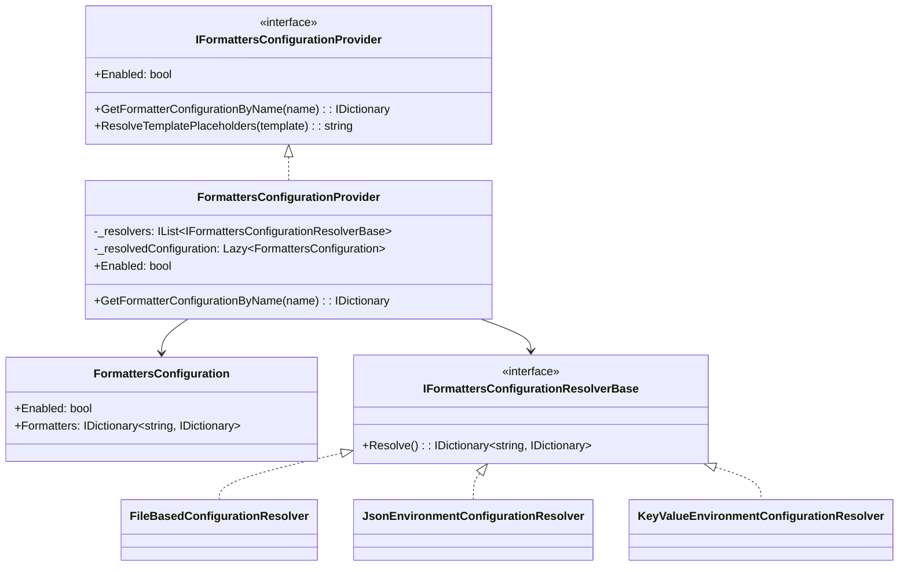

### Example Configuration

```json
{
  "formatters": {
    "message": {
      "outputFilePath": "./TestResults/{timestamp}_reqnroll_report.ndjson"
    },
    "html": {
      "outputFilePath": "./TestResults/{timestamp}_reqnroll_report.html"
    }
  }
}
```

---

## Creating Custom Formatters

To create a custom formatter:

1. **Inherit from appropriate base class**:
   - `FormatterBase` for non-file-based formatters
   - `FileWritingFormatterBase` for file-based formatters

2. **Register in dependency container**:
   ```csharp
   container.RegisterTypeAs<MyCustomFormatter, ICucumberMessageFormatter>("myformatter");
   ```

3. **Implement required abstract methods**:
   - `LaunchInner()` or use base implementation
   - `ConsumeAndFormatMessagesBackgroundTask()` or `WriteToFile()`

4. **Configure in reqnroll.json**:
   ```json
   {
     "formatters": {
       "myformatter": {
         "outputFilePath": "./output.custom"
       }
     }
   }
   ```

---

## Summary

The Formatters subsystem provides a robust, extensible architecture for generating Cucumber Messages output. Key design principles:

- **Pub/Sub Pattern**: Decouples message generation from consumption
- **Async Processing**: Background tasks prevent blocking test execution
- **Lazy Initialization**: Configuration resolved on first access
- **Graceful Shutdown**: Timeouts and cancellation support
- **Thread Safety**: Concurrent collections for parallel test execution

For questions or contributions, please refer to the main [CONTRIBUTING.md](../../CONTRIBUTING.md) guide.
