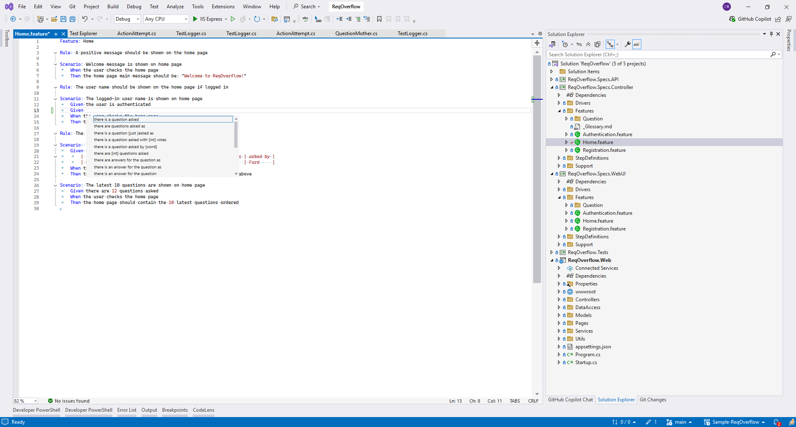
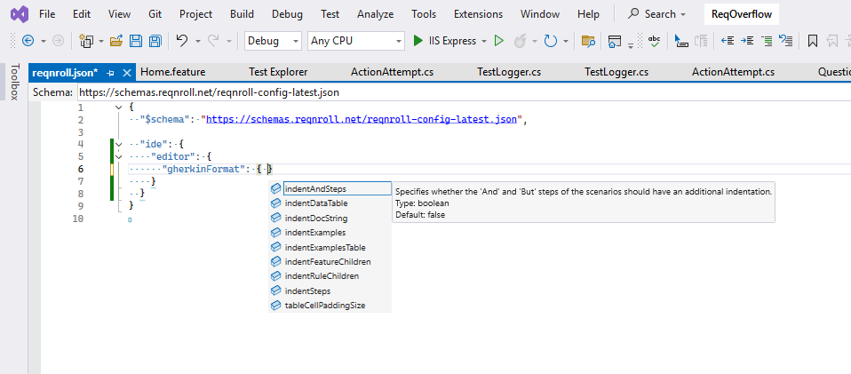
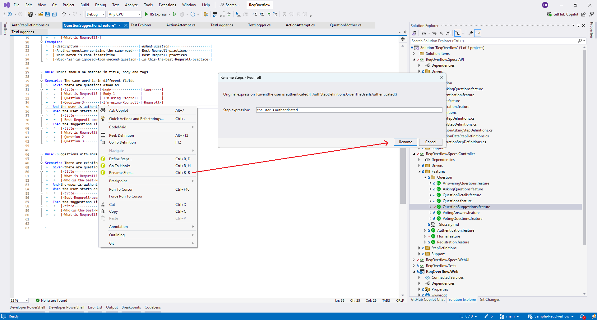

# Editing Features

The Visual Studio integration includes the following features to make it
easier to edit feature files and identify which steps have already been
bound.

## Gherkin Syntax Highlighting

Various default styles have been defined for the Gherkin syntax. You can
customize these colours in Visual Studio\'s settings (**Tools \| Options
\| Environment \| Fonts and Colors**). The names of the corresponding
**Display items** in the list begin with \"Reqnroll\".

In addition to highlighting keywords, comments, tags etc., unbound steps
and parameters in feature files are highlighted when editing the file in
Visual Studio. The following syntax highlighting is used by default:

-   Purple: unbound steps
-   Black: bound steps
-   Grey italics: parameters in bound steps

You can thus tell immediately which steps in a feature file have been
bound.

```{note}
In Reqnroll Visual Studio 2022 plugin a project must be **built** for
syntax highlighting to update.
```

## IntelliSense (auto-completion) for Keywords and Steps

IntelliSense makes Reqnroll easy to use when integrated with Visual
Studio. IntelliSense uses find-as-you-type to restrict the list of
suggested entries.

### Gherkin Files

IntelliSense is available in feature files for the following:

-   Gherkin keywords (e.g. `Scenario`, `Given` etc.)
-   Existing steps are listed after a `Given`, `When` or `Then`
    statement, providing quick access to your current steps definitions.
    Bound steps are indicated with \"\--\>\".

```{note}
Note that all the steps in all \"\*.feature\" files\" that match the
current type (Given, When, Then) are displayed
```

## VS2022




### Code Files

IntelliSense is also available for the Gherkin keywords in your code
files.

### IntelliSense settings

As much as having a suggested list of previous entries could speed up
your work, the list may become too long in a big project and not really
usable. To fix this problem, Reqnroll gives you the option to limit the
number of IntelliSense step instances suggestions for each step
template.

To do this, simply navigate to **Tools \| Options \| Reqnroll \| General
\| IntelliSense** and set the desired number of suggestions you wish to
see against the **Max Step Instances Suggestions** value:

#### VS2022

You must edit the [reqnroll.json](https://reqnroll.net/wp-content/uploads/reqnrollconfigs/reqnroll-config.json) config file to turn IntelliSense on or off and also access other settings as per below:



## Outlining and Comments in Feature Files

Most of the items in the **Edit** menu work well with Reqnroll feature
files, for example:

-   You can comment and uncomment selected lines (\'#\' character) with
    the default shortcut for comments (Ctrl+K Ctrl+C/Ctrl+K Ctrl+U) or
    from the menu
-   You can use the options in the **Edit \| Outlining** menu to expand
    and contract sections of your feature files 

## Table Formatting

Tables in Reqnroll are also expanded and formatted automatically as you
enter column names and values:

```{figure} /_static/images/tablegifvs.gif
:alt: Formatted table

Formatted table
```

## Document Formatting

Document formatting is also available. It automatically re-indents code
and fixes blank lines, comments, etc.

You can find this option under Edit-\>Advanced-\>Format document or
alternatively use the Ctrl+K, Ctrl+D shortcut:

```{figure} /_static/images/format-doc.png
:alt: Format document

Format document
```

Below is a feature file document which is not indented correctly:

```{figure} /_static/images/format-doc-before.png
:alt: Unformatted document

Unformatted document
```

After the `Format Document` command:

```{figure} /_static/images/format-doc-after.png
:alt: Formatted document

Formatted document
```

## Renaming Steps

You can globally rename steps and update the associated bindings
automatically. To do so:

1.  Open the feature file containing the step.
2.  Right-click on the step you want to rename and select Rename from
    the context menu.
3.  Enter the new text for the step in the dialog and confirm with OK.
4.  Your bindings and all feature files containing the step are updated.




> **Note:**
> If the rename function is not affecting your feature files, you may need to restart Visual Studio to flush the cache.

