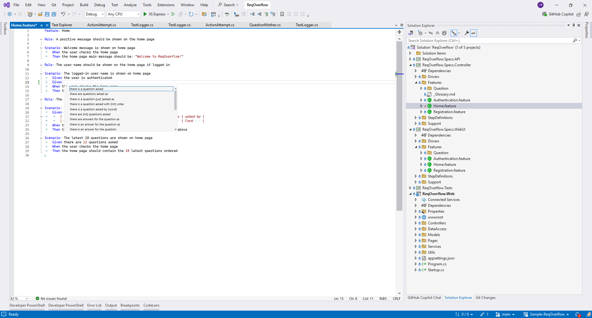
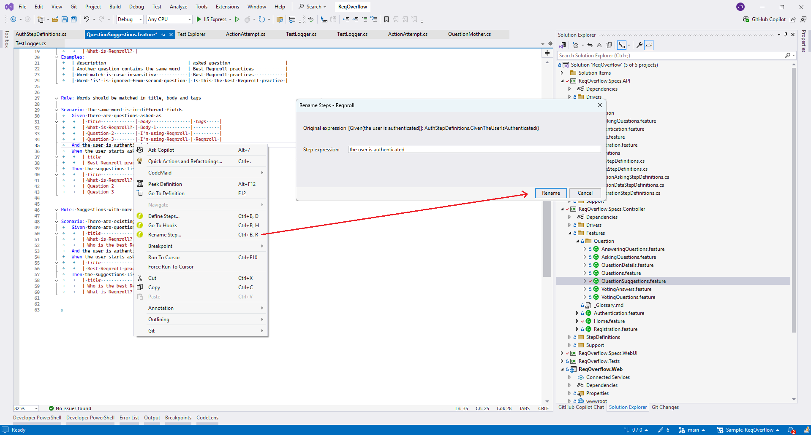

# Editing Features

The Visual Studio extension includes the following features to make it
easier to edit feature files and identify which steps have already been
bound.

```{note}
Many of the formatting behaviors can be controlled by an [EditorConfig file](editorconfig.md) and the `ide` section of the [`reqnroll.json` config file](settings.md#configuring-the-visual-studio-extension-in-the-configuration-file).
```

## Gherkin Syntax Highlighting

Various default styles have been defined for the Gherkin syntax. You can
customize these colors in Visual Studio's settings (**Tools | Options
| Environment | Fonts and Colors**). The names of the corresponding
**Display items** in the list begin with "Reqnroll".

In addition to highlighting keywords, comments, tags etc., unbound steps
and parameters in feature files are highlighted when editing the file in
Visual Studio. The following syntax highlighting is used by default:

-   Purple: unbound steps
-   Black: bound steps
-   Red: parameters in bound steps

You can thus tell immediately which steps in a feature file have been
bound.

```{note}
A project must be **built** for
syntax highlighting to update.
```

## IntelliSense (auto-completion) for Keywords and Steps

IntelliSense makes Reqnroll easy to use when integrated with Visual
Studio. IntelliSense uses find-as-you-type to restrict the list of
suggested entries.

### Gherkin Files

IntelliSense is available in feature files for the following:

-   Gherkin keywords (e.g. `Scenario`, `Given` etc.)
-   Existing steps are listed after a `Given`, `When` or `Then`
    statement, providing quick access to your current steps definitions.

```{note}
Note that all the step definitions that match the current type (Given, When, Then) are displayed initially, but the list can be filtered by typing additional keywords.
```



## Outlining and Comments in Feature Files

Most of the items in the **Edit** menu work well with Reqnroll feature
files, for example:

-   You can comment and uncomment selected lines (`#` character) with
    the default shortcut for comments (Ctrl+K Ctrl+C/Ctrl+K Ctrl+U) or
    from the menu
-   You can use the options in the **Edit | Outlining** menu to expand
    and contract sections of your feature files 

## Table Formatting

Tables in Reqnroll are also expanded and formatted automatically as you
enter column names and values:

```{figure} /_static/images/vs-integration-table-formatting.gif
:alt: Formatted table

Formatted table
```

## Document Formatting

Document formatting is also available. It automatically re-indents code
and fixes blank lines, comments, etc.

You can find this option under *Edit->Advanced->Format document* or
alternatively use the Ctrl+K, Ctrl+D shortcut:

```{figure} /_static/images/vs-integration-format-document.png
:alt: Format document

Format document
```

Below is a feature file document which is not indented correctly:

```{figure} /_static/images/vs-integration-format-document-before.png
:alt: Unformatted document

Unformatted document
```

After the `Format Document` command:

```{figure} /_static/images/vs-integration-format-document-after.png
:alt: Formatted document

Formatted document
```

```{note}
The formatting behavior can be controlled by an [EditorConfig file](editorconfig.md) and the `ide` section of the [`reqnroll.json` config file](settings.md#configuring-the-visual-studio-extension-in-the-configuration-file).
```

## Renaming Steps

You can globally rename steps and update the associated step definitions
automatically. To do so:

1.  Open the feature file containing the step.
2.  Right-click on the step you want to rename and select Rename from
    the context menu.
3.  Enter the new text for the step in the dialog and confirm with OK.
4.  Your step definitions and all feature files containing the step are updated.




```{note}
**Step Rename** is an experimental feature. It only works for those step methods that do not have parameters.
```
