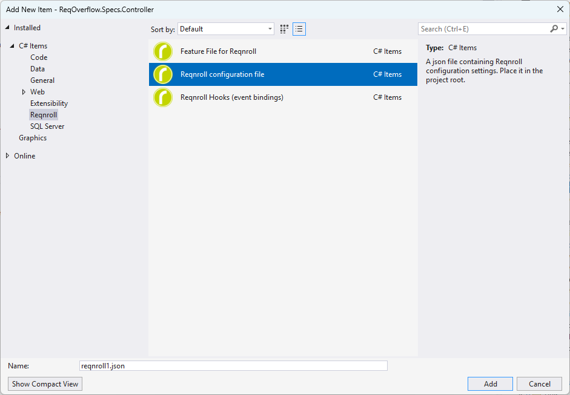

# Extension Settings/Options

The extension settings can be configured as per below:

```{note}
Editor's note: This page needs update to point to the /Installation/Configuration page;
and to include here documentation on each setting within the 'ide' property of the reqnroll.json file.
```

You must edit the [reqnroll.json](https://reqnroll.net/wp-content/uploads/reqnrollconfigs/reqnroll-config.json) config file to access the extension settings. If you don't have the reqnroll.json file you can add it by right clicking on the Reqnroll project -> Add -> New item... -> Add Reqnroll configuration file.

The configuration file has a JSON [schema](https://reqnroll.net/wp-content/uploads/reqnrollconfigs/reqnroll-config.json), therefore you will see all available properties as you start typing.

**Important:** You must build your project for the changes in reqnroll.json to take effect.



