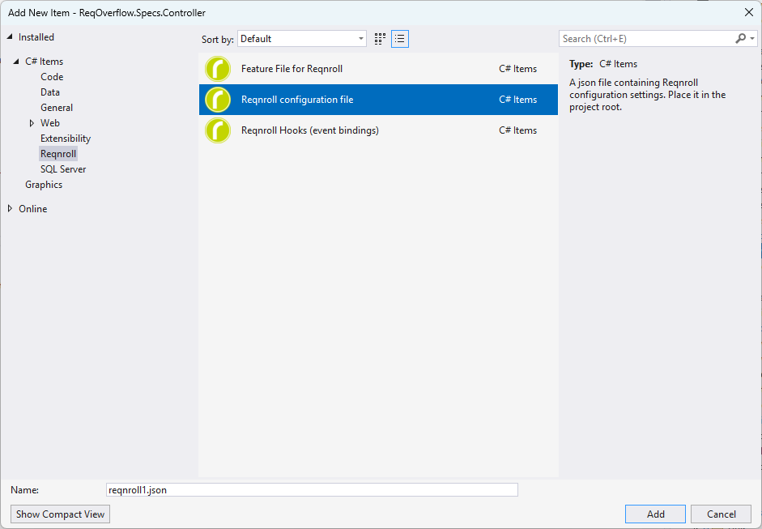
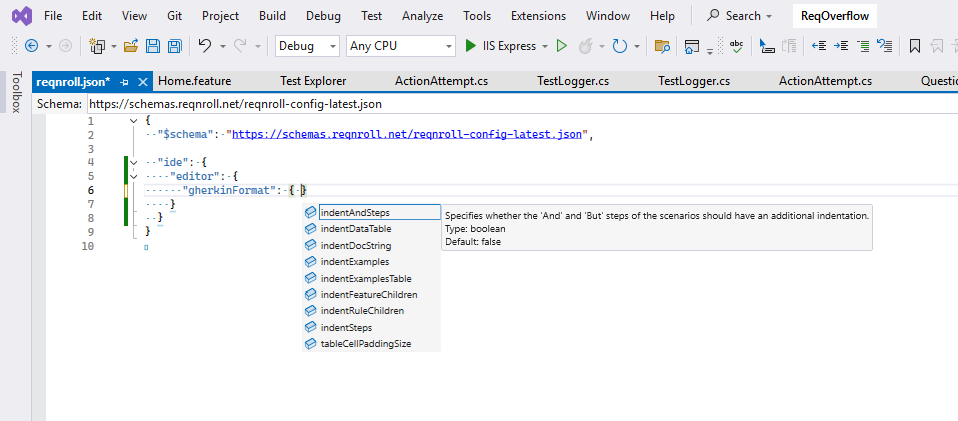

# Visual Studio Extension Settings

To change the Visual Studio extension settings, edit the [`reqnroll.json`](/installation/configuration.md) config file. If you don't have the `reqnroll.json` file you can add it by right clicking on the *Reqnroll project -> Add -> New item... -> Add Reqnroll configuration file*.



```{note}
The formatting behavior can also be controlled by an [EditorConfig file](editorconfig.md).
```

The configuration file has a [JSON schema](https://schemas.reqnroll.net/reqnroll-config-latest.json), therefore you will see all available properties as you start typing.

 


## Configuring the Visual Studio extension in the configuration file

The `ide` section of the `reqnroll.json` file configures all settings related to the **Integrated Development Environment (IDE)** for Reqnroll projects. This section is extensible and allows fine-tuning of your development experience with Reqnroll. For other sections of the configuration file, please check the [Reqnroll Configuration Reference](/installation/configuration.md).

The following sections are available within the `ide` section:

<!-- no toc -->
* [`editor` Section](#editor-section)
* [`traceability` Section](#traceability-section)
* [`reqnroll` Section](#reqnroll-section)
* [`bindingDiscovery` Section](#bindingdiscovery-section)

```{note}
You must build your project for the changes in `reqnroll.json` to take effect.
```

### Example `ide` Configuration

```json
"ide": {
  "editor": {
    "showStepCompletionAfterStepKeywords": true,
    "gherkinFormat": {
      "indentFeatureChildren": false,
      "indentSteps": true
    }
  },
  "traceability": {
    "tagLinks": [
      {
        "tagPattern": "issue:(?<id>\\d+)",
        "urlTemplate": "https://github.com/org/repo/issues/{id}"
      }
    ]
  }
}
```


## `editor` Section

- **Purpose**: Controls editor behaviors such as feature file formatting and code completion.
- **Settings**:
    - `showStepCompletionAfterStepKeywords` (boolean): Enables/disables step completions after keywords (`Given`, `When`, etc.). Default: `true`.
    - `gherkinFormat` (object): Controls the formatting of Gherkin feature files.
        - `indentFeatureChildren` (boolean): Indent children of `Feature` (`Background`, `Rule`, etc.). Default: `false`.
        - `indentRuleChildren` (boolean): Indent children of `Rule` elements. Default: `false`.
        - `indentSteps` (boolean): Indent steps in scenarios. Default: `true`.
        - `indentAndSteps` (boolean): Extra indent for "And"/"But" steps. Default: `false`.
        - `indentDataTable` (boolean): Indent `DataTable` arguments. Default: `true`.
        - `indentDocString` (boolean): Indent `DocString` arguments. Default: `true`.
        - `indentExamples` (boolean): Indent `Examples` blocks. Default: `false`.
        - `indentExamplesTable` (boolean): Indent `Examples` tables. Default: `true`.
        - `tableCellPaddingSize` (integer): Padding for table cells (spaces, default: `1`).
        - `tableCellRightAlignNumericContent` (boolean): Specifies whether Table cells that contain digits should be right-aligned. Default: `true`.

### Example

```json
"ide": {
  "editor": {
    "showStepCompletionAfterStepKeywords": true,
    "gherkinFormat": {
      "indentFeatureChildren": false,
      "indentSteps": true,
      "indentAndSteps": false,
      "tableCellPaddingSize": 1
    }
  }
}
```

## `traceability` Section

- **Purpose**: Enables traceability settings for scenarios, such as linking scenario tags to external issue trackers.
- **Settings**:
    - `tagLinks` (array): Defines patterns for tags and the corresponding external URLs.
        - Each entry:
            - `tagPattern` (string): Regex to match tag names (e.g., `"issue:(?<id>\\d+)"`).
            - `urlTemplate` (string): URL template using captured regex groups (e.g., `"https://github.com/org/repo/issues/{id}"`).


### Example

The following example configures the extension to turn `@issue:1234` tags to clickable links to open the related GitHub issue.

```json
"ide": {
  "traceability": {
    "tagLinks": [
      {
        "tagPattern": "issue:(?<id>\\d+)",
        "urlTemplate": "https://github.com/org/repo/issues/{id}"
      }
    ]
  }
}
```

## `reqnroll` Section

```{note}
Specifying this section is only required for special cases when Reqnroll is not configured via NuGet packages.
```

- **Purpose**: Handles project-level settings related to Reqnroll itself.
- **Settings**:
    - `isReqnrollProject` (boolean): Enables the project as a Reqnroll project. Default: *(auto-detect)*.
    - `configFilePath` (string): Path to `App.config` or `reqnroll.json`. Default: *(auto-detect)*.
    - `version` (string): Specifies the Reqnroll version (e.g., `"2.3.1"`). Default: *(auto-detect)*.
    - `traits` (array): List of traits (e.g., `"XUnitAdapter"`, `"MsBuildGeneration"`, `"DesignTimeFeatureFileGeneration"`). Default: *(detected from NuGet packages)*.

## `bindingDiscovery` Section

```{note}
Specifying this section is only required for special cases when the built-in binding discovery does not work.
```

- **Purpose**: Manages settings for discovering step bindings within the IDE.
- **Settings**:
    - `connectorPath` (string): File path to custom binding connector. Can reference environment variables (e.g., `%ENV_VAR%`). Relative paths use the default connector folder as base.
